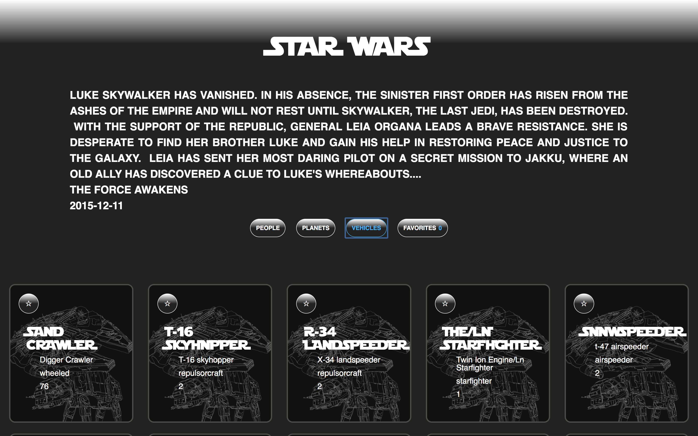

# SWAPI-Box 

## Synopsis

SWAPI Box leverages the Star Wars API to display information about the people, planets, and vehicles from the Star Wars universe.

### Tools 

* Star Wars data from [SWAPI](https://swapi.co/documentation)
* Star Wars line drawings [Sam Hallowsl](https://www.behance.net/gallery/3446581/Star-Wars-Continuous-Line-Illustrations)

### *Example* 

---

## Contributors

Jeremiah Stanley

_(**Turing School of Software & Design Front-end Engineering project - Mod 3:** [SWAPI Box Project Spec](http://frontend.turing.io/projects/swapi-box.html))_ 

